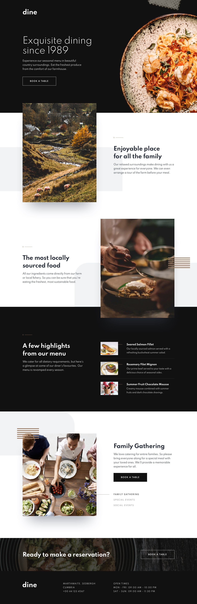
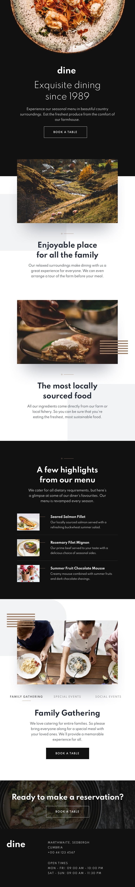
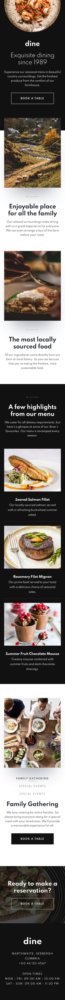

# Dine restaurant website

## Frontend Mentor

### live demo

[Dine restaurant website](https://marcinkisiel.github.io/frontend-mentor-dine-restaurant/)

### description

This is my solution for **_[Frontend Mentor](https://www.frontendmentor.io/challenges/dine-restaurant-website-yAt7Vvxt7)_** challenge, which was to build out this 2-page restaurant. 
The design includes mobile, tablet & desktop views for a **Homepage** and **Booking** page. A design system is also included to provide colors, fonts, etc.

### current status

unfinished (only views for **Homepage**)

### implementation time

November 2020

### technologies

HTML, CSS, JavaScript

### tools used

Sass (SCSS), [Swiper](https://swiperjs.com/)

### design

Frontend Mentor
 

### contact

**Marcin Kisiel**:
 
[kisiel.marcin@gmail.com](mailto:kisiel.marcin@gmail.com)
 
[LinkedIn](https://www.linkedin.com/in/marcin-kisiel/)
 
[GitHub](https://github.com/marcinkisiel)
 
